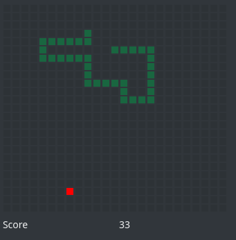

# Snake
Snake game in Python using PyQt



# Dependencies
- PyQt5
- Python3

# How to use 
Make snek.sh executable
```bash
./snek.sh 
```

Command | Result  
------------ | -------------  
Press directional keys |  Move the snek
Press ESC| Pause game. Press any key to resume 
